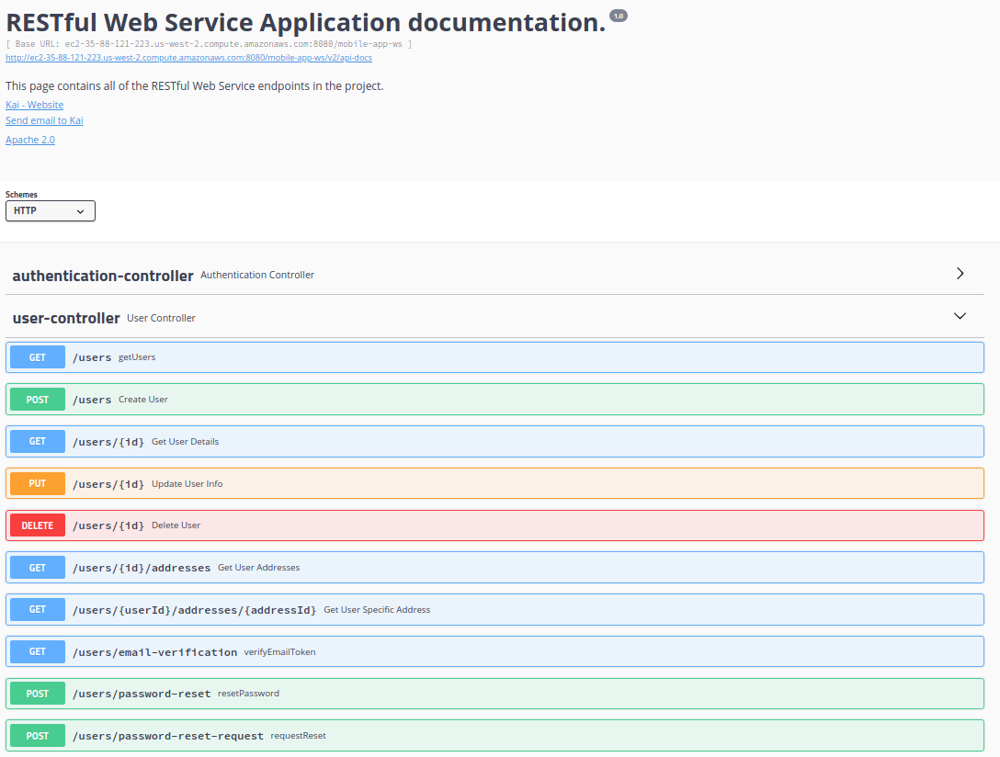

# restful-webservices-app
Description: This is a RESTful web application project that implements API calls such as user sign-up/login, email verification sent from AWS SNS, password reset, update, delete. 
The project was built using Spring MVC and Spring Boot, and it has been deployed to Amazon AWS Cloud.

